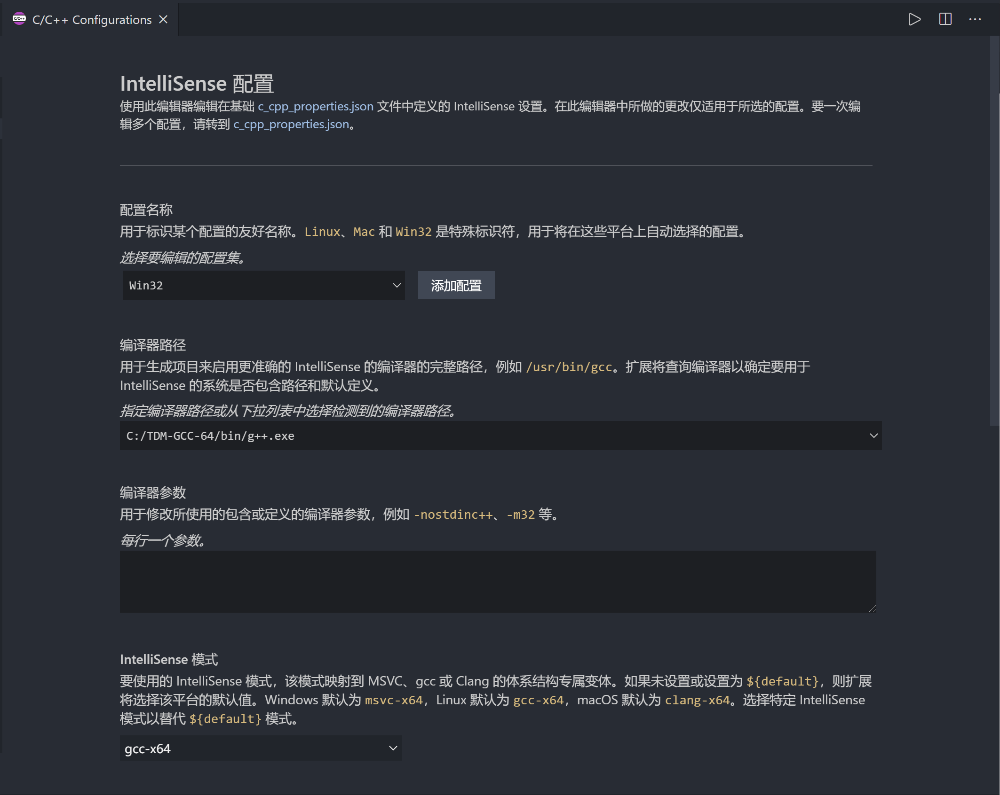
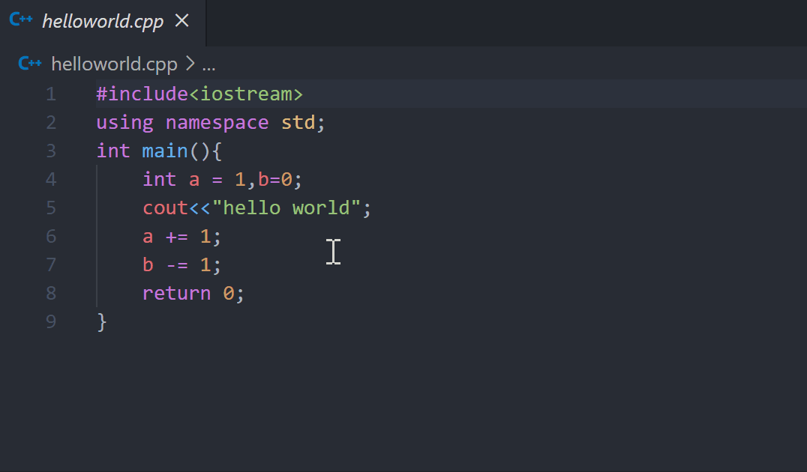

author: NachtgeistW, Ir1d, ouuan, Enter-tainer, Xeonacid, ChungZH, keepthethink, abc1763613206, partychicken, Chrogeek, xkww3n

## 简介

Visual Studio Code（以下简称 VS Code) 是一个由微软开发，同时支持 Windows、Linux 和 macOS 等操作系统且开放源代码的代码编辑器。它是用 TypeScript 编写的，并且采用 Electron 架构。它带有对 JavaScript、TypeScript 和 Node.js 的内置支持，并为其他语言（如 C、C++、Java、Python、PHP、Go）提供了丰富的扩展生态系统。

官网： [Visual Studio Code - Code Editing. Redefined](https://code.visualstudio.com/) 

## 使用 Code Runner 插件运行代码

VS Code 安装并配置插件后可实现对 C/C++ 的支持，但配置过程比较复杂。一个简单的编译与运行 C++ 程序的方案是安装 Code Runner 插件。

Code Runner 是一个可以一键运行代码的插件，在工程上一般用来验证代码片段，支持 Node.js、Python、C、C++、Java、PHP、Perl、Ruby、Go 等 40 多种语言。

安装的方式是在插件商店搜索 Code Runner 并点击 Install；或者前往 [Marketplace](https://marketplace.visualstudio.com/items?itemName=formulahendry.code-runner) 并点击 Install，浏览器会自动打开 VS Code 并进行安装。

安装完成后，打开需要运行的文件，点击右上角的小三角图标即可运行代码；按下快捷键<kbd>Ctrl</kbd>+<kbd>Alt</kbd>+<kbd>N</kbd>（在 macOS 下是<kbd>Control</kbd>+<kbd>Option</kbd>+<kbd>N</kbd>）也可以得到同样的效果。

???+ warning
    如果安装了 VS Code 与 Code Runner 后，代码仍然无法运行，很有可能是因为系统尚未安装 C/C++ 的运行环境，参考 [Hello, World! 页面](../../lang/helloworld.md) 以安装。

    记得勾选设置中的 Run In Terminal 选项，如图：
    

## 使用 C/C++ 插件编译并调试

### 安装插件

在 VS Code 中打开插件商店，在搜索栏中输入 `C++` 或者 `@category:"programming languages"` ，然后找到 C/C++，点击 Install 安装插件。

???+ warning
    在配置前，请确保系统已经安装了 G++ 或 Clang，并已添加到了 `PATH` 中。请使用 CMD 或者 PowerShell，而不是 Git Bash 作为集成终端。

### 配置编译

首先用 VS Code 打开一个文件夹，然后按下<kbd>F1</kbd>，输入 `C/C++: Edit configurations (UI)` ，进入 C/C++ 插件的设置界面。

在“编译器路径”中选择 G++ 或 Clang 的所在路径。如果没有可选项，请检查编译器所在路径是否添加到了操作系统的 `PATH` 变量中。

### 配置 IntelliSense

用于调整 VS Code 的智能补全。

如果你使用 Clang 编译器，在“IntelliSense 模式”中选择 `clang-x64` 而非默认的 `msvc-x64` ；如果你使用 G++ 编译器，选择 `gcc-x64` 以使用自动补全等功能。否则会得到“IntelliSense 模式 msvc-x64 与编译器路径不兼容。”的错误。

### 配置 GDB/LLDB 调试器

在 VS Code 中新建一份 C++ 代码文件，按照 C++ 语法写入一些内容（如 `int main(){}` ），保存并按下<kbd>F5</kbd>，进入调试模式。
如果出现了“选择环境”的提示，选择“C++ (GDB/LLDB)”。在“选择配置”中，G++ 用户选择 `g++.exe - 生成和调试活动文件` ；Clang 用户选择 `clang++ - 生成和调试活动文件` 。

???+ warning

    配置名称并非固定，而是可以自定义的。不同的操作系统可能具有不同的配置名称。

完成后，VS Code 将自动完成初始化操作并弹出一个 `launch.json` 配置文件。关闭它。

至此，所有的配置流程已经完毕。再次按下<kbd>F5</kbd>即可看到软件下方的调试信息。

若要在以后使用 VS Code 编译并调试代码，所有的源代码都需要保存至这个文件夹内。若要编译并调试其他文件夹中存放的代码，需要重新执行上述步骤（或将旧文件夹内的 `.vscode` 子文件夹复制到新文件夹内）。

### 开始调试代码

使用 VS Code 打开一份代码，将鼠标悬停在行数左侧的空白区域，并单击出现的红点即可为该行代码设置断点。再次单击可取消设置断点。

按下<kbd>F5</kbd>进入调试模式，编辑器上方会出现一个调试工具栏，四个蓝色按钮从左至右分别代表 GDB 中的 `continue` , `next` , `step` 和 `until` ：

如果编辑器未自动跳转，点击左侧工具栏中的“调试”图标进入调试窗口，即可在左侧看到变量的值。

在调试模式中，编辑器将以黄色底色显示下一步将要执行的代码。
